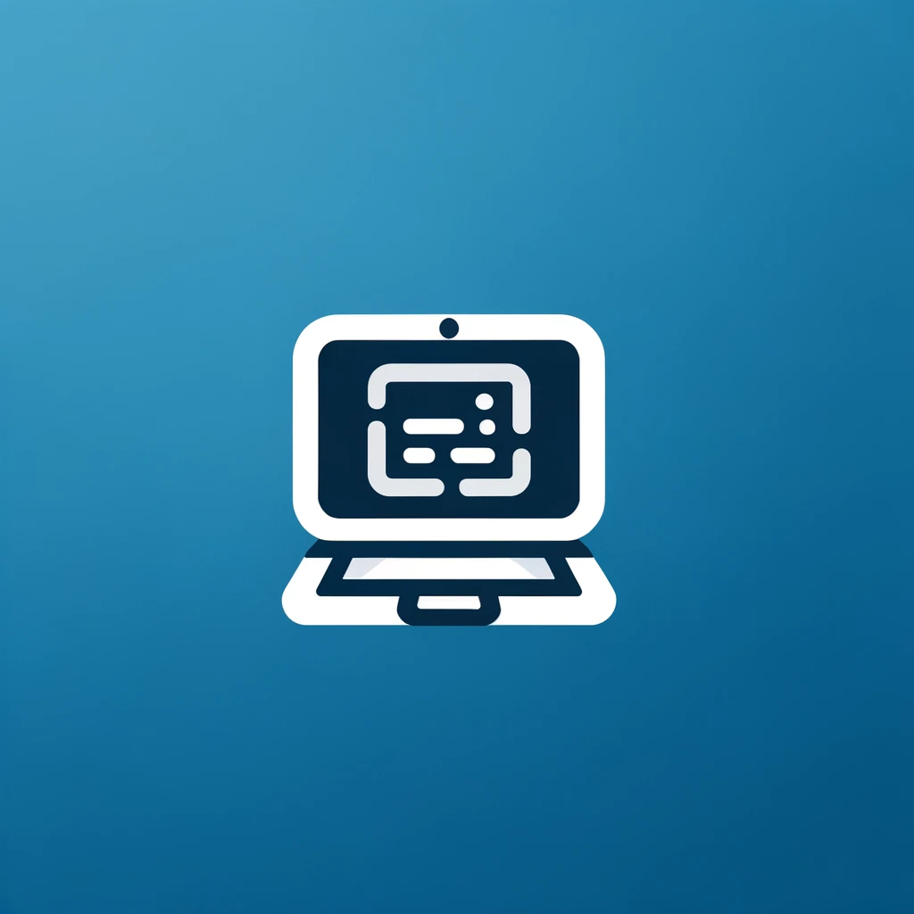

# My Personal Sandbox

> A representation of my journey as a developer

This is my portfolio site! Here I document different things that I've learned and projects that I've worked on throughout my software engineering career.

## Purpose

> Why did I choose to create this site?

When asked about what technologies I've used, projects I've created or worked on, and lessons that I've learned in my software development/cloud engineering education, I find that it is an extremely difficult question to answer. There are so many aspects and details that fall under these umbrella terms - conversations become easily convoluted or short-sighted.

Creating and maintaining this site allows me to note different points of my programming and cloud engineering journey while also displaying my ability to create feature-rich applications.

## Features

### Portfolio

This portion of the site displays a number of the projects and work that I've created or collaborated on.

Each project card is a link to the repository that contains its relevant source code.

- The repositories have READMEs and markdown files explaining their purpose, structure, and architecture, as well as links to relevant contributors and contribution instructions.
- Each card also has a linked to the deployed application if it has been deployed.

Additionally, this page contains a gallery of some interesting site features and technology familiarity descriptions.

### Blog

This page of the site contains software engineering/cloud engineering blog posts.

©Tom Childress 2024

